# Experiments

>[!IMPORTANT]
>In this report two different experiments are featured. *Alternative* traversability refers to just a small modification of the vanilla traversability criteria. This is just a small curiosity that I wanted to explore very briefly. Whereas *adaptive* traversability is something different. Adaptive traversability describes a more substantial change to how traversability is defined and is the main focus of the project. Just don't get confused.

## Alternative Traversability Criteria

In the vanilla algorithm a gate is traversable if the radius of its minimum Delaunay circle  is $\geq \alpha$. This definition can be motivated with the idea of using a spherical spoon of radius $\alpha$ to carve out the inside cell without touching any of the vertices.

The minimum Delaunay circle corresponds to one of the following 3 cases:

1. It is the smallest sphere through the gate vertices (left image)
2. It is the circumcircle of the *inside* cell (middle image)
3. It is the circumcircle of the *outside* cell (right image)

<table>
  <tr>
    <td>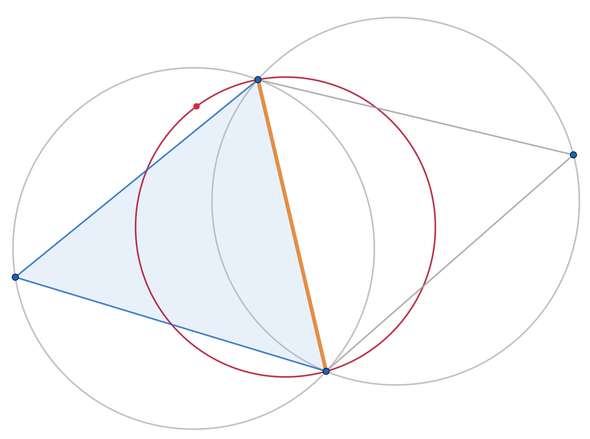</td>
    <td>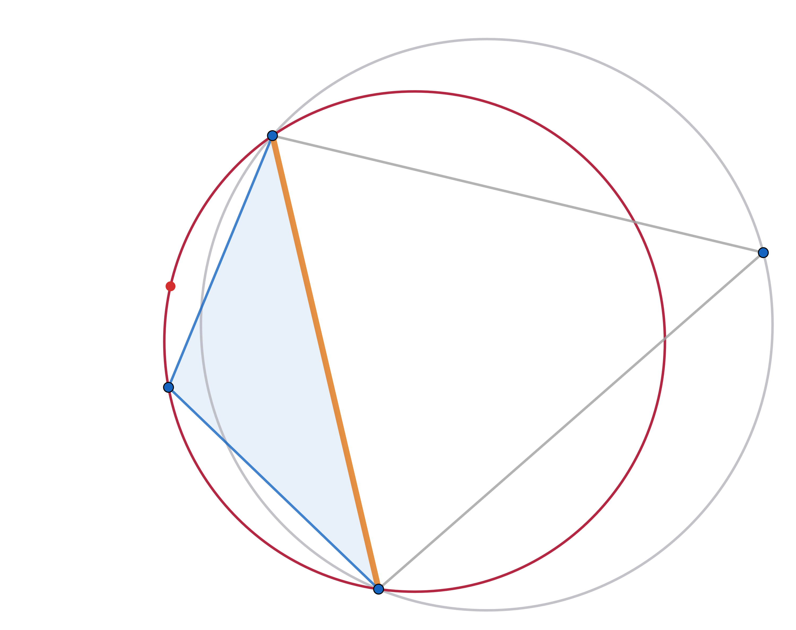</td>
    <td>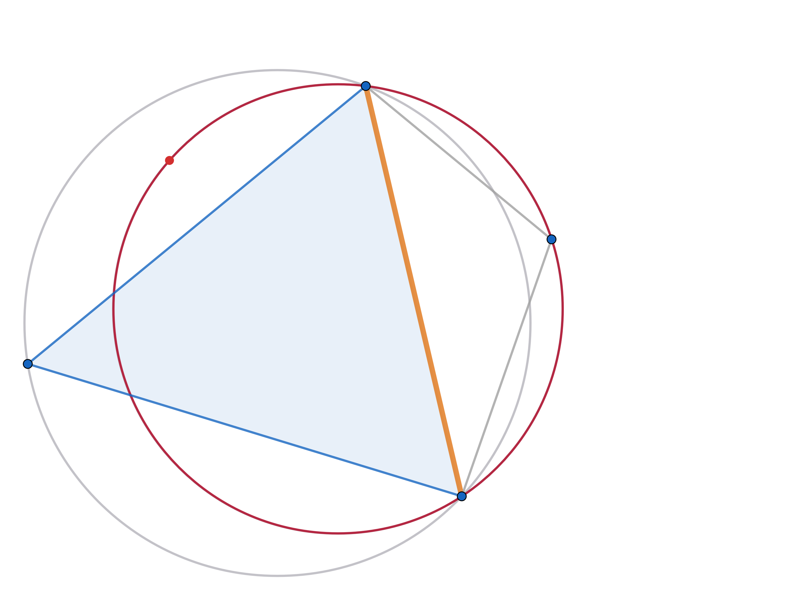</td>
  </tr>
</table>

>[!NOTE]
>Shown in the images is a *gate* (orange) with an adjacent *inside* cell (blue) and an adjacent *outside* cell (white). Displayed in gray are the circrumcircles of these cells. The red circle indicates the minimum Delaunay circle. (The red dot has no meaning, it was just used as a handle in geogebra...)

Suppose we have a spherical spoon with radius $\alpha$, then we want to start from the outside cell and carve out the inside cell by passing through the gate. If the minimum Delaunay circle has radius larger than $\alpha$, for the first two cases, this task can be achieved. The third case is different though, as a gate might be marked traversable despite the spoon not being able to fully carve out the inside cell, starting from the outside region. Such a situation is displayed below.

  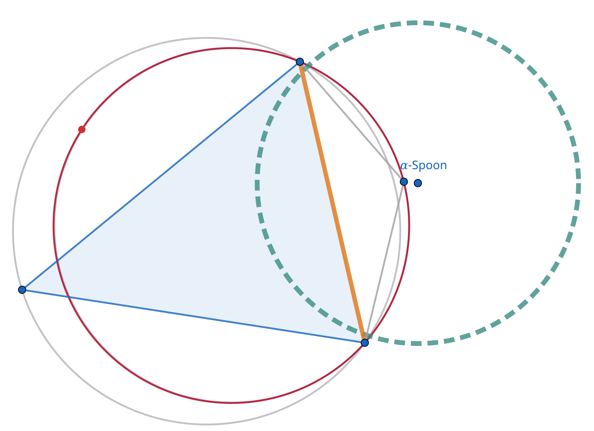

Due to this observation, I decided to briefly explore a modified version of the algorithm, where in the third case, $\alpha$ is not compared to the radius of the minimum Delaunay circle, but just the minimum circle through the gate. Meaning that if case 3 occurs, the gate is only deemed traversable, if the entire $\alpha$ -spoon can fit through the gate. This modified version is available through a different build configuration. There is a cmake preset `alternative-trav` available to build the algorithm with this modification.

A small experiment was run with `--alpha 0.01` and `--offset 0.01` on 8 example inputs. A table showing parts of the output statistics is shown below. The data and svg exports of the experiment are available in the supplementary material (`experiments/alternative_traversability`).

| Example  | Iterations (Default) | Iterations (Modified) | Iterations Δ | Runtime \[ms\] (Default) | Runtime \[ms\] (Modified) | Runtime Δ |
| -------- | -------------------- | --------------------- | ------------ | ------------------------ | ------------------------- | --------- |
| example1 | 686                  | 680                   | -6           | 104.80                   | 98.25                     | -6.55     |
| example2 | 710                  | 701                   | -9           | 94.54                    | 93.99                     | -0.55     |
| example3 | 542                  | 540                   | -2           | 51.93                    | 56.22                     | 4.29      |
| example4 | 744                  | 743                   | -1           | 44.45                    | 44.03                     | -0.42     |
| example5 | 724                  | 714                   | -10          | 56.96                    | 55.78                     | -1.18     |
| example6 | 1166                 | 1163                  | -3           | 128.82                   | 129.13                    | 0.31      |
| example7 | 900                  | 886                   | -14          | 74.07                    | 76.07                     | 2.00      |
| example8 | 710                  | 708                   | -2           | 69.23                    | 68.90                     | -0.33     |

The following observations were made:
- The modified versions takes fewer iterations to terminate.
- There is no significant change in runtime.
- There is no easily recognizable visual change in the produced output. 

It is to be expected that the modified version takes fewer iterations as we strengthen the condition for traversability, i.e., consider fewer gates for processing. The cases where the modification has an influence on traversability seem to be rare enough for it not to make a noticeable difference.This topic could be explored further, e.g., by testing with different parameters, using a wider range of inputs, or implementing it into the 3D algorithm. Yet from this first look it seems to have a tiny impact on how the algorithm behaves.

## Adaptive Traversability

### Traversability Parameters

#### Target Length

There are a couple of parameters to tune the adaptive traversability methods. Most important is the **target length** parameter, which takes the following roles:

- Deviation based: Target length of the subsegments used in the deviation computation
- Intersection based: Target length for the spacing between the sample points

For both methods this parameter allows us to control how large a hole need to be for it to be considered traversable. A large target length results in a less detailed evaluation of a gate where small features are less likely to make a difference on traversability. A small target length allows small input features to have a bigger influence on the traversability of the gate.

The target length parameter is set equal to the specified $\alpha$ parameter. When comparing the adaptive methods to using a constant alpha, all the methods use the same value for $\alpha$ and the target length.

#### Other Parameters

The remaining parameters cannot be specified through the command line tool. These parameters are stored in the `DeviationBasedParams` and `IntersectionBasedParams` structs, located in  `/include/alpha_wrap_2/traversability.h`  See the source code comments for a detailed explanation of their purpose. For the experiments the values specified in `main.cpp` were used.

### Comparison

The 3 methods (global alpha, deviation-based and intersection-based) were compared on a small dataset of just 8 example inputs. The comparison below shows the obtained output using different parameters on just one of the example inputs. The full experimental data for all 8 examples is available in the supplementary material.

#### $\alpha=0.01$ and $\epsilon=0.01$

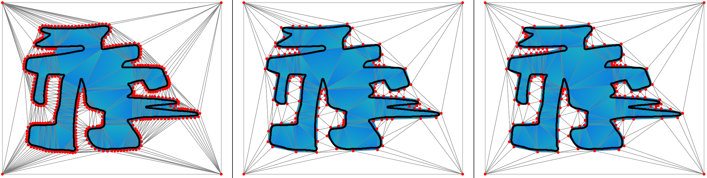

#### $\alpha=0.01$ and $\epsilon=0.05$

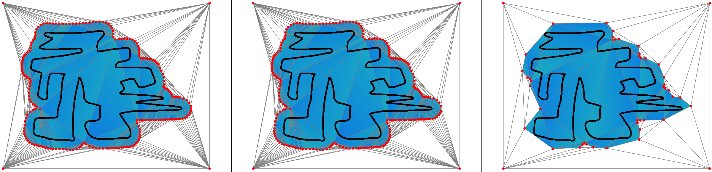

#### $\alpha=0.05$ and $\epsilon=0.01$

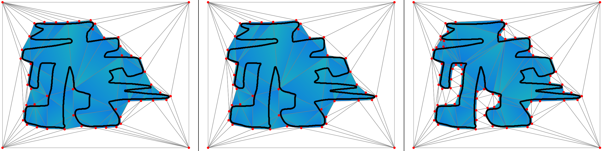

#### $\alpha=0.05$ and $\epsilon=0.05$

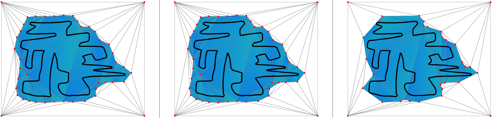

### Runtime

Below is a runtime comparison of for the four different configurations. In these plots the runtime for all 8 examples are shown. For each example it is shown how time was distributed for each individual task of the algorithm, where:
- 'Rule1' and 'Rule2' refer to the time spent on checking if one of the rules apply or not
- 'Gate processing' refers to the time spent checking gates for traversability

<table>
  <tr>
    <td>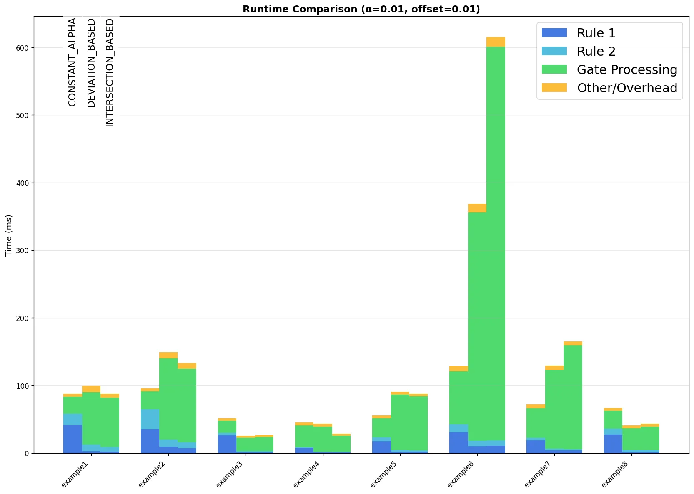</td>
    <td>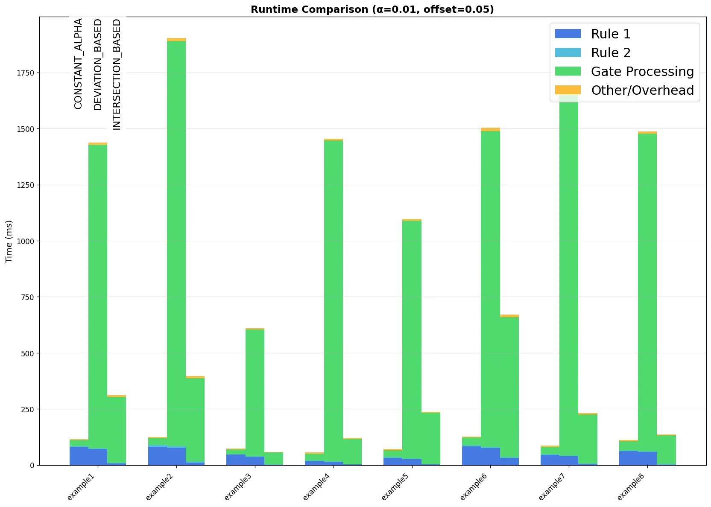</td>
  </tr>
  <tr>
    <td>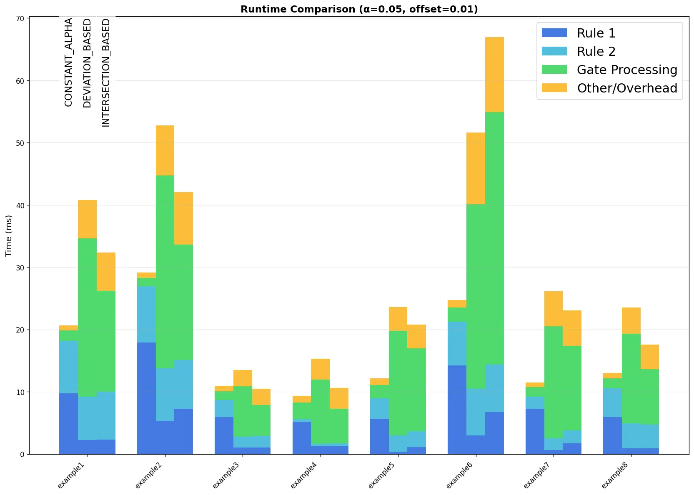</td>
    <td>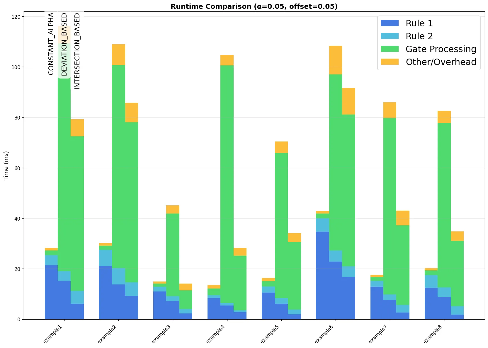</td>
  </tr>
</table>

### Discussion

#### Observations

In these experiments we can observe the following:

- The adaptive methods are able to more economically insert vertices
- Both adaptive methods spend less time for checking R1 and R2, but spend much more time on checking the traversability of gates.
- Intersection-based traversability more consistently produces desirable results and usually terminates faster than deviation-based traversability. In particular the deviation-based method fails to produce a satisfying result when increasing the offset.

#### Considerations

This comparison should however merely give a rough idea of what sort of results can be produced by these methods. It does *not* necessarily offer a complete or fair comparison of these methods. The following points should be mentioned to add some context to the results:

- To make the result in some way comparable, all methods used the same value for  $\alpha$ or target length. However, better results might be achieved by choosing  the remaining traversability parameters  of the adaptive methods differently. 
- The implementation of the procedure for updating the queue can be made more efficient. Currently the queue is cleared and rebuilt by checking every facet in the triangulation. The adaptive methods would especially benefit from a more efficient implementation, as checking gates for traversability is what currently takes up most of their runtime.
- The methods were compared on a small dataset of rather simple example inputs which were all described by a  *dense* point cloud. Behavior on "messy" real-world data might be different.

#### Conclusion

Deviation-based traversability can under some circumstances produce decent results, however in many aspects it is inferior to intersection-based traversability which profits from the following advantages:

- Often produces more desirable results and usually terminates faster
- More robust towards changes in the offset parameter
- Fewer and more meaningful traversability parameters 
- Easier to adjust to different input types and a 3D scenario

Intersection-based traversability appears to be a viable approach for adaptive traversability. From these experiments it cannot be concluded yet if it is able to produce satisfyable results for 3D real-world inputs and do so within reasonable runtime. This could however be explored in terms of future work, as it is fairly simple to extend this modification to the 3D algorithm. 