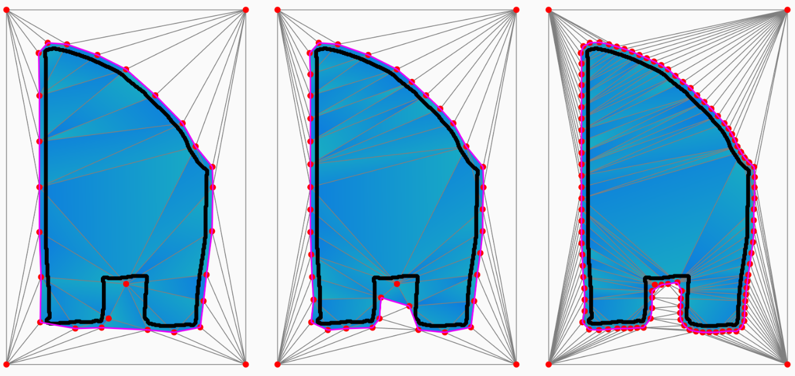

# Project

## Alpha Wrapping with an Offset

Alpha wrapping with an offset is an algorithm presented in a [paper](https://inria.hal.science/hal-03688637) from 2022, authored by Portaneri et al. Alongside the paper, an implementation of the algorithm was made available through [CGAL](https://doc.cgal.org/latest/Alpha_wrap_3/index.html).

>[!NOTE]
>**Abstract**: Given an input 3D geometry such as a triangle soup or a point set, we address the problem of generating a watertight and orientable surface triangle mesh that strictly encloses the input. The output mesh is obtained by greedily refining and carving a 3D Delaunay triangulation on an offset surface of the input, while carving with empty balls of radius alpha. The proposed algorithm is controlled via two user-defined parameters: alpha and offset. Alpha controls the size of cavities or holes that cannot be traversed during carving, while offset controls the distance between the vertices of the output mesh and the input. Our algorithm is guaranteed to terminate and to yield a valid and strictly enclosing mesh, even for defect-laden inputs. Genericity is achieved using an abstract interface probing the input, enabling any geometry to be used, provided a few basic geometric queries can be answered. We benchmark the algorithm on large public datasets such as Thingi10k, and compare it to state-of-the-art approaches in terms of robustness, approximation, output complexity, speed, and peak memory consumption. Our implementation is available through the CGAL library.

### Simplified Description of the Algorithm

At initialization, a bounding box of the input geometry is constructed and its vertices are inserted into a Delaunay triangulation. Each cell of the triangulation is labeled either *inside* or *outside*. Initially, all finite cells are labeled *inside* and all infinite cells are labeled *outside*.

A *gate* is a facet where one adjacent cell is labeled *inside* and the other *outside*. The algorithm maintains a queue of *traversable* gates—these are gates that satisfy a traversability criterion. In each iteration, one such gate is considered and one of two possible operations is performed on the gate:

- **Refinement**: Construct a point on the offset surface and insert it into the triangulation.
- **Carving**: Mark the inside cell as outside.

There are two rules (called R1 and R2) that are checked to determine if a refinement is needed at a gate. These rules ensure that the input geometry is not exposed to the outside and, if applicable, yield a point to insert into the triangulation. If none of the rules applies, the inside cell can be carved safely (i.e., it can be marked as *outside*).

The algorithm iterates as long as traversable gates are present in the triangulation. Once the queue of traversable gates is empty, the offset surface can be extracted as the set of facets separating inside from outside.

Below is a simplified pseudo-code description of the algorithm where `D` denotes a Delaunay triangulation and `Q` denotes the queue where the traversable gates are stored. 

```
insert bounding box vertices into D
insert traversable gates into Q

while Q not empty:
	f <- Q.pop()
	
	if R1(f):
		insert point into D
	else if R2(f):
		insert point into D
	else:
		c_in <- get_inside_cell(f)
		mark c_in as OUTSIDE
		
	update Q
	
extract offset surface
```


## Project Overview

As part of this project I implemented a version of this algorithm that works on 2D scenarios and is limited to point cloud inputs. This implementation is *not* based on the CGAL alpha wrapping implementation; however, it does use structures and algorithms from the CGAL library (e.g., Delaunay triangulation or k-d tree).

### Adaptive Traversability

A *gate* is a facet of the triangulation where one adjacent cell is marked *inside* and the other adjacent cell is marked *outside*. The algorithm can perform a refinement or carving operation at a gate. To avoid indefinite processing, the algorithm only considers gates that are deemed *traversable*. A gate is traversable if the radius of the minimum Delaunay ball through the gate is $\geq\alpha$.

The alpha wrapping algorithm described in the paper uses a global $\alpha$ parameter to control the granularity of the reconstructed surface. Using a large $\alpha$ can miss input details, whereas choosing a small value often leads to unnecessary insertion of vertices in flat regions.



As part of the project I experimented with adaptive traversability criteria that determine the traversability of a gate based on the local input geometry. Two different approaches are implemented in this repository: 

- *Deviation-based traversability*: This was a first attempt at adaptive traversability. The method is admittedly rather messy and suffers from issues that make it hard to achieve good results.
- *Intersection-based traversability*: A simpler and more elegant method that avoids many of the issues of the deviation-based approach. 

>[!NOTE] 
>Below is a brief textual description of these methods, also see p.31-34 in the slides of the supplementary material for a visual explanation.
#### Deviation-Based Traversability

To determine if a gate $f$ is traversable, the following procedure is used:
- Construct an axis-aligned bounding box around $f$
- Find all the input points $p_{i}$ that are located within this bounding box
- Compute the mean squared distance from these points to $f$.

$$
\delta=\frac{1}{N}\sum_{i=1}^N d(f,p_{i})^2
$$

From the measured deviation $\delta$ we then obtain a value for $\alpha$. In this implementation, this is achieved by constructing a normalized deviation $\tilde{\delta}$ $\in [0,1]$.

$$
	\tilde{\delta}= \text{clamp}(\mu \cdot \lvert \delta - \epsilon^2 \rvert, 0, 1)
$$

- If the gate approximates the offset surface well, we expect the deviation to be close to $\epsilon^2$.
- We use a parameter $\mu$ (in code referred to as `deviation_factor`) to control sensitivity. Larger values mean a normalized deviation of $1$ is reached more quickly.

From this normalized deviation value, $\alpha$ is obtained as:

$$
\alpha = (1-\tilde{\delta})\alpha_{\text{max}} + \tilde{\delta} \alpha_{\text{min}}
$$

where $\alpha_{\text{min}}$ equals the value specified by the user through `--alpha` and $\alpha_{\text{max}}$ is a fixed value specified in the traversability parameters.

##### Subsegment Improvement

The approach outlined above often finds a small deviation in cave-like areas because many relevant input features are not captured by the gate’s bounding box. To address this, the gate is split into smaller segments $f_{j}$ for which the deviation $\delta_{j}$ is computed. These segments are constructed to have a length of $\approx L_{\text{target}}$, where the target length is specified as a global parameter. The deviations are then aggregated to a single value for the gate.

$$
	\tilde{\delta} = \max_{j} \{ \tilde{\delta}_{j} \}
$$

In 'cave-like' areas we are thus more likely to end up with a subsegment whose bounding box only contains very few or no input points. For such segments we artificially assign a large deviation ($\tilde{\delta}$ $=1$), which will consequently lead to a large deviation for $f$, making the gate more likely to be traversable.

Even with this improvement several issues still persist:
- The bounding boxes might still not always capture the local input geometry well.
- An average squared deviation of $\epsilon^2$ does not necessarily mean that the offset surface is approximated well
- Finding good parameters for obtaining the normalized deviation $\tilde{\delta}$ and mapping it to $\alpha$ can be challenging

There are certainly ways to further improve this method. However, it seems more promising to consider a second approach that aims to avoid many of the aforementioned problems.

#### Intersection-Based Traversability

To determine if a gate $f$ is traversable, it is sampled at points $q_{i}$. In this implementation the points are sampled equidistantly such that the spacing is $\approx L_{\text{target}}$. Then we consider the line segments $(q_{i}, q_{i} + \lambda n)$ where $n$ is the normal vector ([^1]) of $f$ and $\lambda$ is a user-defined global parameter. For each such segment we check if it intersects the offset surface. If at any point there is no intersection (i.e., the distance between the point and the offset surface is $>\lambda$), we mark the gate as traversable.

With this approach we skip the step of constructing a value for $\alpha$; instead, we directly test proximity to the offset surface.

[^1]: A point $q_{i}$ can be within or outside of the offset-surface. In the first case, the normal is chosen as pointing towards the outside-cell of the gate. In the second case it is chosen as pointing towards the inside-cell of the gate.